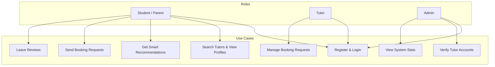
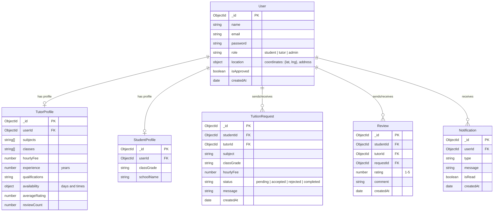
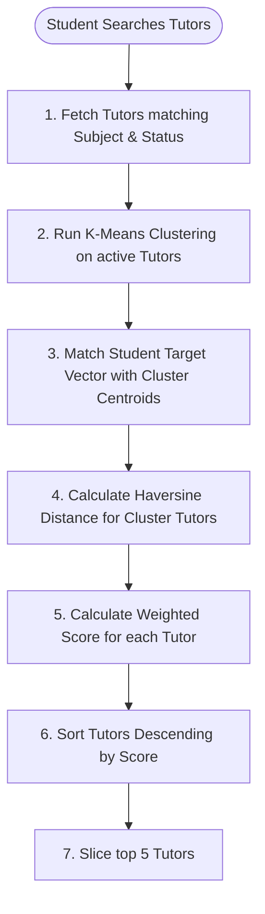
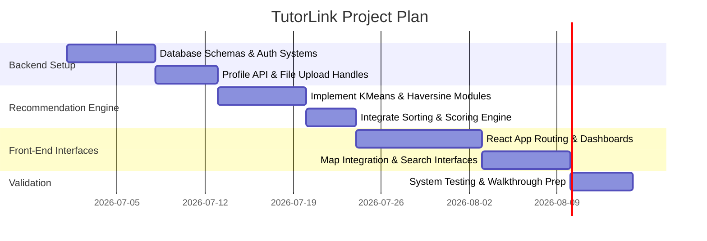

# TutorLink - Architectural & Implementation Plan

This document outlines the software architecture, database design, algorithm integration, and phased implementation roadmap for **TutorLink**, a smart tutor recommendation system built as a Final Year Computer Science project.

---

## 1. Requirements Specification

### Functional Requirements
*   **Authentication & Authorization:**
    *   Secure registration and login for Students/Parents, Tutors, and Admins.
    *   JWT-based role protection (e.g., student-only search, tutor-only request approval).
*   **Profile Management:**
    *   Tutors can build profiles specifying subject catalog, hourly fee, qualification details, experience, days of availability, and geographic coordinates (latitude and longitude).
    *   Students can update contact info, target location, and educational grade.
*   **Smart Recommendation & Search:**
    *   Students can filter tutors by subject, availability, budget, and distance.
    *   A recommendation engine executes a 3-step algorithmic filter (K-Means → Best Cluster Matching → Haversine & Weighted Scoring) to present the top 5 matches.
*   **Request & Booking Lifecycle:**
    *   Students can send tuition requests to selected tutors, specifying subjects, timings, and custom details.
    *   Tutors receive request notifications and can approve or reject them.
*   **Review System:**
    *   Students can review and rate (1-5 stars) a tutor after a tuition request is marked as "Completed".
*   **Admin Console:**
    *   Manage user status (approve/reject new tutors, block users).
    *   Monitor dashboard stats (tutors count, success rate of requests, active bookings).

### Non-Functional Requirements
*   **Algorithm Modularity & Performance:** Algorithmic routines (K-Means, Haversine) must be cleanly decoupled in `server/algorithms/` to simplify complexity analysis and unit testing for academic evaluation.
*   **Security:** Passwords must be hashed using `bcrypt` (10 salt rounds). JWT access tokens must reside in HTTP-only cookies or authorization headers.
*   **Usability:** Mobile-friendly and responsive UI built using React and Tailwind CSS.
*   **Geospatial Accuracy:** Haversine formula must calculate real-world physical distances rather than Euclidean flat approximations of Lat/Lng coordinates.

---

## 2. User Roles & Key Use Cases



### Key User Journeys

#### Student Recommendation & Booking Journey
1.  **Onboarding:** Student registers and grants browser location access (or sets location on a map) to save coordinates.
2.  **Discovery:** Student inputs search criteria (e.g., subject "Maths", budget "50", distance "5km").
3.  **Algorithmic Sorting:** System triggers K-Means to partition tutor search spaces, selects the most relevant cluster, ranks them using weighted scoring, and displays the top 5 matches on an interactive map.
4.  **Booking:** Student selects a tutor, sends a tuition request, and monitors request status in their dashboard.

#### Tutor Qualification & Verification Journey
1.  **Profile Setup:** Tutor registers, fills in profile details, uploads certificates, sets hourly fee and availability slots, and enters address coordinate location.
2.  **Pending Approval:** Tutor enters a read-only pending state until an administrator reviews and approves the profile.
3.  **Active Matching:** Once approved, the tutor becomes indexable in K-Means clustering runtimes and can accept incoming student requests.

---

## 3. System Architecture & Folder Structure

TutorLink is designed around the classic **MVC (Model-View-Controller)** pattern for the backend, separated from a Single Page Application (SPA) frontend.

```
findTutor/
├── client/                     # Frontend Application (React + Vite)
│   ├── public/
│   └── src/
│       ├── assets/             # Images, global assets
│       ├── components/         # Reusable UI parts (Cards, Navbars, MapViews)
│       ├── context/            # AuthContext, NotificationContext
│       ├── hooks/              # Custom React hooks (useAuth, useMap)
│       ├── layouts/            # Layout wraps (AuthLayout, DashboardLayout)
│       ├── pages/              # Page components (Home, Search, Dashboard)
│       ├── services/           # Axios HTTP request services (api.js)
│       └── utils/              # Client helpers
├── server/                     # Backend API (Node.js + Express)
│   ├── algorithms/             # Core CS Algorithm Library
│   │   ├── KMeans.js           # K-Means clustering algorithm
│   │   ├── Haversine.js        # Haversine distance calculator
│   │   └── RecommendationEngine.js # Weighted rank aggregator
│   ├── config/                 # DB connections, Env configs
│   ├── controllers/            # Controller layers handling HTTP requests
│   ├── middleware/             # JWT Validation, Error handlers
│   ├── models/                 # Mongoose schemas
│   ├── routes/                 # Express route definitions
│   ├── services/               # DB helper services
│   └── uploads/                # Static folder for document uploads
```

---

## 4. Database Schema Design & ER Diagram



### Database Collections Schema Definition

#### User Collection (`User.js`)
```javascript
{
  name: { type: String, required: true },
  email: { type: String, required: true, unique: true },
  password: { type: String, required: true },
  role: { type: String, enum: ['student', 'tutor', 'admin'], required: true },
  location: {
    type: { type: String, default: 'Point' },
    coordinates: [Number] // [longitude, latitude] for GeoJSON
  },
  address: { type: String },
  isApproved: { type: Boolean, default: false }, // Crucial for tutor onboarding
  createdAt: { type: Date, default: Date.now }
}
```

#### Tutor Profile Collection (`TutorProfile.js`)
```javascript
{
  userId: { type: Schema.Types.ObjectId, ref: 'User', required: true, unique: true },
  subjects: [{ type: String, required: true }],
  classes: [{ type: String }],
  hourlyFee: { type: Number, required: true },
  experience: { type: Number, required: true }, // years
  qualifications: { type: String, required: true },
  availability: [{
    day: { type: String, enum: ['Monday', 'Tuesday', 'Wednesday', 'Thursday', 'Friday', 'Saturday', 'Sunday'] },
    slots: [String] // e.g. ['16:00-18:00', '18:00-20:00']
  }],
  averageRating: { type: Number, default: 0 },
  reviewCount: { type: Number, default: 0 }
}
```

---

## 5. Recommendation Engine Algorithmic Design

The recommendation process filters and scores tutors using a hybrid K-Means, Haversine, and custom multi-criteria scoring system.



### Algorithm 1: K-Means Clustering (`KMeans.js`)

We cluster active, approved tutors to find sub-groups matching general characteristics. 

#### Feature Vector Design
Tutors are represented as a 5-dimensional vector:
$$V = [x_1, x_2, x_3, x_4, x_5]$$
where:
*   $x_1$ = Latitude
*   $x_2$ = Longitude
*   $x_3$ = Hourly Fee
*   $x_4$ = Experience (Years)
*   $x_5$ = Average Rating (0 - 5)

#### Feature Normalization
Because fees (e.g., $10–$100), ratings ($0.0–$5.0), and lat/lng coordinates reside in completely different numeric scales, raw coordinates would cause higher-valued attributes to dominate distance computations. 
We apply **Min-Max Normalization** to compress each feature value into the range $[0, 1]$ before clustering:
$$x'_{i} = \frac{x_i - \min(X)}{\max(X) - \min(X)}$$

#### Cluster Execution Loop
1.  **Initialization:** Choose $K$ initial centroids (we can set $K = \sqrt{N/2}$ or a static default $K = 3$).
2.  **Assignment:** Assign each tutor $i$ to the closest centroid $c_j$ based on normalized Euclidean distance:
    $$D(V_i, C_j) = \sqrt{\sum_{d=1}^{5} (V_{i,d} - C_{j,d})^2}$$
3.  **Update:** Recalculate centroids as the mean of all vector points assigned to that cluster:
    $$C_j = \frac{1}{|S_j|} \sum_{V_i \in S_j} V_i$$
4.  **Convergence:** Repeat Assignment and Update stages until centroids shift below a threshold ($\epsilon = 0.001$) or max iterations ($100$) is met.

#### Finding the Best Cluster for Student Search
When a student executes a query:
1.  Build a **Student Target Vector** in the normalized feature space:
    $$V_{student} = [Lat_{std}, Lng_{std}, Budget_{std}, Exp_{preferred}, 5.0]$$
    *(Target rating is set to 5.0 as the ideal preference)*
2.  Compute Euclidean distance between $V_{student}$ and each computed cluster centroid $C_j$.
3.  Select the cluster with the smallest distance. **This cluster's tutors pass to the next phase.**

---

### Algorithm 2: Haversine Distance (`Haversine.js`)

To evaluate precise geographic distances between the student and tutors inside the selected cluster, we apply the Haversine formula (great-circle distance):

$$d = 2 R \arcsin\left(\sqrt{\sin^2\left(\frac{\Delta \phi}{2}\right) + \cos(\phi_1)\cos(\phi_2)\sin^2\left(\frac{\Delta \lambda}{2}\right)}\right)$$

Where:
*   $\phi_1, \phi_2$ = Latitude of Student and Tutor (in radians)
*   $\lambda_1, \lambda_2$ = Longitude of Student and Tutor (in radians)
*   $\Delta \phi = \phi_2 - \phi_1$
*   $\Delta \lambda = \lambda_2 - \lambda_1$
*   $R$ = Radius of the Earth ($6371$ km)

---

### Algorithm 3: Weighted Recommendation Score (`RecommendationEngine.js`)

Once tutors are isolated within the matching cluster, we rank them using a compound weighted scoring formula:

$$\text{Total Score} = w_1 S_{dist} + w_2 S_{subj} + w_3 S_{avail} + w_4 S_{budget} + w_5 S_{exp} + w_6 S_{rating}$$

| Weight | Component | Identifier | Description |
| :--- | :--- | :--- | :--- |
| **35%** | Distance Score | $S_{dist}$ | Physical proximity via Haversine calculation |
| **25%** | Subject Match | $S_{subj}$ | Matches tutor catalog subjects |
| **15%** | Availability Match | $S_{avail}$ | Intersecting day/time availability slots |
| **10%** | Budget Match | $S_{budget}$ | Pricing comparison to student's budget |
| **10%** | Experience | $S_{exp}$ | Relative teaching experience metrics |
| **5%** | Rating | $S_{rating}$ | Customer reviews and rating value |

#### Component Formulas

1.  **Distance Score ($S_{dist}$):**
    $$S_{dist} = \max\left(0, 1 - \frac{d}{d_{max}}\right)$$
    *(where $d_{max}$ is a default search threshold limit, e.g., $15$ km. If $d \ge 15$ km, score is $0$)*
2.  **Subject Match ($S_{subj}$):**
    $$S_{subj} = \begin{cases} 1.0 & \text{if Searched Subject } \in \text{ Tutor's Subjects} \\ 0.0 & \text{otherwise} \end{cases}$$
3.  **Availability Match ($S_{avail}$):**
    $$S_{avail} = \frac{|\text{Student Requested Slots} \cap \text{Tutor Available Slots}|}{|\text{Student Requested Slots}|}$$
4.  **Budget Match ($S_{budget}$):**
    $$S_{budget} = \begin{cases} 1.0 & \text{if Fee } \le \text{ Student Budget} \\ \max\left(0, 1 - \frac{\text{Fee} - \text{Budget}}{\text{Budget}}\right) & \text{if Fee } > \text{ Student Budget} \end{cases}$$
5.  **Experience ($S_{exp}$):**
    $$S_{exp} = \min\left(1.0, \frac{\text{Tutor Experience}}{E_{ideal}}\right) \quad (\text{where } E_{ideal} = 5 \text{ years})$$
6.  **Rating ($S_{rating}$):**
    $$S_{rating} = \frac{\text{Tutor Average Rating}}{5.0} \quad (\text{unrated tutors default to } 3.0 \text{ rating, i.e., } 0.6 \text{ score})$$

---

## 6. API Interface Design

### Authentication Routes
*   `POST /api/auth/register` - Creates user record.
*   `POST /api/auth/login` - Authenticates credentials, issues JWT.
*   `GET /api/auth/me` - Verifies token validity and returns active session role.

### Profiles Routes
*   `GET /api/tutors` - Fetch all approved tutors (Admin/Student lists).
*   `GET /api/tutors/:id` - Fetch tutor details, availability, and rating reviews.
*   `PUT /api/tutors/profile` - Update profile data (subjects, hourlyFee, availability, coordinates). (Tutor auth required).
*   `PUT /api/students/profile` - Update student profile configurations. (Student auth required).

### Core Recommendation Route
*   `POST /api/recommendations` - Run algorithmic matching.
    *   **Request Body:**
        ```json
        {
          "subject": "Mathematics",
          "maxBudget": 60,
          "maxDistance": 10,
          "preferredExperience": 3,
          "availability": [
            { "day": "Monday", "slots": ["16:00-18:00"] }
          ]
        }
      ```
    *   **Response Payload:** Array of top 5 matching Tutor objects, including calculated Haversine distance, matching score, and coordinate maps.

### Requests & Bookings Routes
*   `POST /api/requests` - Student creates a tuition request targeting a tutor.
*   `GET /api/requests/student` - List requests sent by the current student.
*   `GET /api/requests/tutor` - List requests received by the current tutor.
*   `PATCH /api/requests/:id` - Accept/reject request (Tutors) or mark complete (Student/Tutor).

### Admin Management Routes
*   `GET /api/admin/pending-tutors` - List newly registered tutors awaiting profile check.
*   `PATCH /api/admin/approve-tutor/:id` - Approve a tutor profile to make them active.
*   `DELETE /api/admin/users/:id` - Ban or delete a user profile.

---

## 7. Phased Development Roadmap



### Phase 1: Foundation & Authentication (Estimated: 7 Days)
*   Setup database configurations inside Express.
*   Develop Mongoose Schemas for `User`, `TutorProfile`, `StudentProfile`.
*   Implement JWT generation, login paths, and role check middleware wrappers (`isAdmin`, `isTutor`, `isStudent`).

### Phase 2: Core MVC Features (Estimated: 5 Days)
*   Build profiles API CRUD paths.
*   Set up static file upload directories to store tutor certificate uploads.
*   Build base paths for Tuition Requests, Reviews, and Notification records.

### Phase 3: Algorithmic Recommendation Layer (Estimated: 11 Days)
*   Create standalone math services under `server/algorithms/`:
    *   `Haversine.js` - Computes physical distance.
    *   `KMeans.js` - Coordinates matrix conversions, normalization, and runs K-Means steps.
    *   `RecommendationEngine.js` - Runs K-Means, isolates the target cluster, calculates Haversine values, executes the weighted scoring, and orders results.
*   Develop integration test cases validating accuracy of the recommendation engine.

### Phase 4: Frontend Development (Estimated: 17 Days)
*   Setup Vite React bundle with Tailwind CSS config.
*   Integrate React Router for navigation.
*   Build dashboards for Tutors, Students, and Admins.
*   Integrate Leaflet map component to render geolocated tutor positions.

### Phase 5: Verification & Deployment (Estimated: 5 Days)
*   Conduct manual interface walkthrough validations.
*   Prepare the final evaluation artifacts (`walkthrough.md`, user guides).
