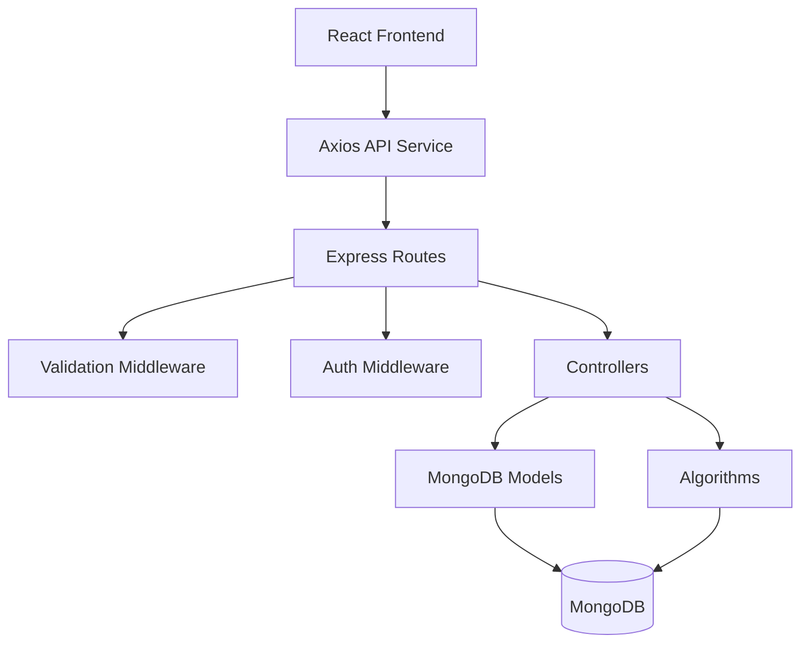
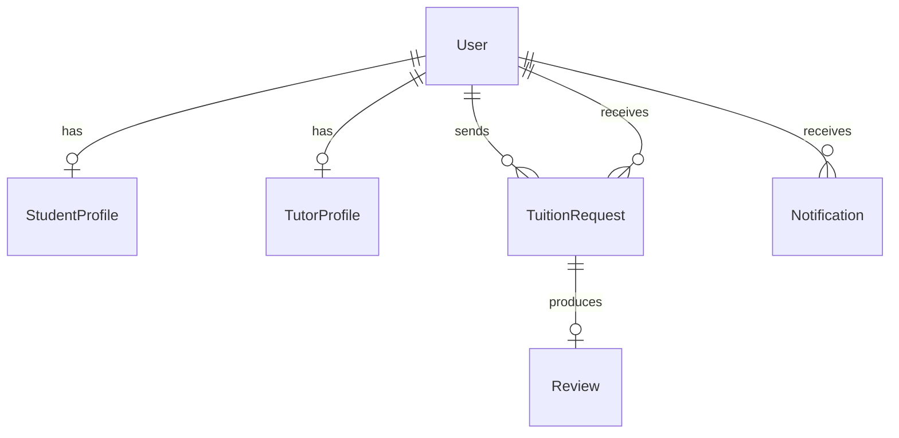
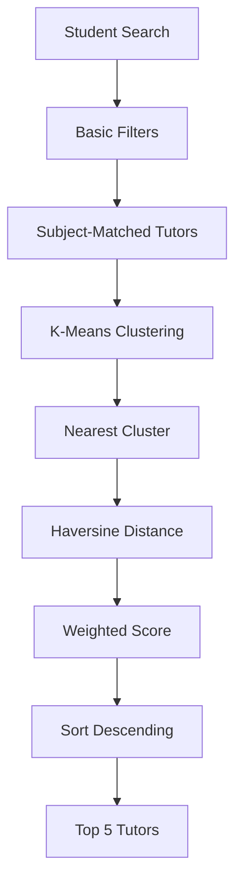

# TutorLink

TutorLink is a final year Computer Science project that connects students and parents with suitable home tutors. The main academic contribution is a smart tutor recommendation system that combines K-Means Clustering, the Haversine distance formula, and a weighted ranking algorithm to return the most relevant tutors instead of a flat list of profiles.

This README is written as a report-generation brief for another AI. It describes the project structure, architecture, database design, APIs, workflows, security model, and algorithmic decisions in a format that can be reused to generate a full university project report.

## Project Summary

- **Project name:** TutorLink
- **Project type:** Final Year Computer Science Project
- **Domain:** Tutor discovery, recommendation, booking, and review management
- **Primary contribution:** Smart tutor recommendation engine
- **Architecture:** MVC with a service-like algorithm layer
- **Frontend:** React, Vite, Tailwind CSS, React Router, Axios
- **Backend:** Node.js, Express.js
- **Database:** MongoDB with Mongoose
- **Authentication:** JWT and bcrypt
- **Maps:** OpenStreetMap with Leaflet and React Leaflet

TutorLink is designed for users who need nearby, affordable, and relevant tutors. The system supports student and tutor registration, profile management, tutor search, smart ranking, request handling, reviews, and notifications. The backend also contains admin-facing tutor management endpoints.

## Problem Statement

Users often struggle to find tutors manually because traditional tutor directories do not rank by distance, fee, availability, or teaching fit. TutorLink solves this by recommending tutors through a structured algorithmic workflow that considers both geographic and academic suitability.

## Proposed Solution

The recommendation flow works in three stages:

1. Tutors are filtered by subject relevance.
2. Matching tutors are grouped with K-Means Clustering.
3. Tutors in the nearest cluster are ranked using a weighted score that includes distance, availability, budget, experience, and rating.

The top five tutors are returned to the student.

## Core Functional Areas

### Authentication

- Register users as students, tutors, or admins.
- Log users in with email and password.
- Verify the current session with a protected `/api/auth/me` endpoint.
- Protect private routes using JWT-based middleware.

### Student Features

- Create and update student profiles.
- Search for tutors by subject and recommendation criteria.
- Send tuition requests.
- Track request status.
- Leave a review after completion.

### Tutor Features

- Create and update tutor profiles.
- Add subjects, classes, hourly fee, experience, qualifications, and availability.
- Upload a certificate file.
- View and respond to student requests.
- Receive notifications.

### Admin Features

- View tutor-management screens.
- Review legacy pending-tutor data.
- Approve tutor accounts through admin endpoints.

### Recommendation Engine

- Subject pre-filtering
- K-Means clustering
- Best-cluster selection
- Haversine distance scoring
- Weighted ranking
- Top-five output

### Inquiry and Review System

- Students send tuition requests to tutors.
- Tutors accept or reject requests.
- Requests can be marked completed.
- Reviews are only allowed after completion.
- Notifications are generated for request and review events.

## Software Architecture

TutorLink follows a layered MVC-style architecture.

| Layer | Responsibility |
| --- | --- |
| View | React pages, layouts, components, map UI |
| Controller | Express request handlers |
| Model | Mongoose schemas and MongoDB collections |
| Service / Algorithm Layer | K-Means, Haversine, recommendation ranking |

### Architecture Diagram

## Project Folder Structure

### Root

- `PROJECT_CONTEXT.md` - project background and development principles
- `Implementation.md` - overall implementation and architecture plan
- `PROJECT_DOCUMENTATION.md` - detailed master knowledge base for report generation

### Client

- `client/src/main.jsx` - React bootstrap
- `client/src/App.jsx` - route definitions and route guards
- `client/src/context/AuthContext.jsx` - authentication state and session logic
- `client/src/context/NotificationContext.jsx` - notification polling and read state
- `client/src/layouts/DashboardLayout.jsx` - shared dashboard shell
- `client/src/pages/` - landing page, login, register, dashboards, tutor search, bookings, tutor requests, schedule, pending tutors
- `client/src/components/MapView.jsx` - map display for tutor locations
- `client/src/services/api.js` - centralized API client

### Server

- `server/server.js` - Express application bootstrap
- `server/config/db.js` - MongoDB connection
- `server/controllers/` - auth, profile, request, review, notification, recommendation handlers
- `server/models/` - User, StudentProfile, TutorProfile, TuitionRequest, Review, Notification
- `server/routes/` - REST route definitions
- `server/middleware/` - JWT protection, role authorization, validation, file uploads
- `server/validators/` - Zod schemas for request validation
- `server/algorithms/` - clustering, distance, and recommendation logic
- `server/uploads/` - uploaded certificate files
- `server/tests/recommendation.test.js` - recommendation test coverage

## Database Design

### User

Stores identity, role, address, and coordinates.

| Field | Notes |
| --- | --- |
| name | Required |
| email | Required, unique |
| password | Hashed, excluded from normal queries |
| role | student, tutor, or admin |
| location | GeoJSON point with longitude and latitude |
| address | Required |
| isApproved | Present in the schema; accounts are active by default in the current registration flow |

### StudentProfile

Stores student-specific academic data.

| Field | Notes |
| --- | --- |
| userId | One-to-one reference to User |
| classGrade | Required |
| schoolName | Optional |

### TutorProfile

Stores tutor subject and service information.

| Field | Notes |
| --- | --- |
| userId | One-to-one reference to User |
| subjects | Required array of subjects |
| classes | Required array of grades/classes |
| hourlyFee | Required numeric fee |
| experience | Required years of experience |
| qualifications | Required text |
| availability | Weekly availability slots |
| averageRating | Updated from reviews |
| reviewCount | Updated from reviews |
| certificate | Optional uploaded file path |

### TuitionRequest

Tracks the student-to-tutor inquiry lifecycle.

| Field | Notes |
| --- | --- |
| studentId | References User |
| tutorId | References User |
| subject | Required |
| classGrade | Required |
| hourlyFee | Required |
| status | pending, accepted, rejected, completed |
| message | Optional |

### Review

Stores post-completion tutor feedback.

| Field | Notes |
| --- | --- |
| studentId | References User |
| tutorId | References User |
| requestId | Unique reference to TuitionRequest |
| rating | 1 to 5 |
| comment | Required |

### Notification

Stores request and review alerts.

| Field | Notes |
| --- | --- |
| userId | Notification owner |
| type | request_received, request_status, review_received |
| message | Required |
| isRead | Boolean read flag |

### Entity Relationships

## API Surface

### Authentication

| Method | Endpoint | Purpose |
| --- | --- | --- |
| POST | `/api/auth/register` | Register a user |
| POST | `/api/auth/login` | Log in a user |
| GET | `/api/auth/me` | Return the current user and profile |

### Profiles

| Method | Endpoint | Purpose |
| --- | --- | --- |
| PUT | `/api/profiles/student` | Update student profile |
| PUT | `/api/profiles/tutor` | Update tutor profile |
| POST | `/api/profiles/upload-certificate` | Upload tutor certificate |
| GET | `/api/profiles/tutors` | List tutors with profiles |
| GET | `/api/profiles/tutors/:id` | Fetch tutor by user ID |
| GET | `/api/profiles/admin/pending-tutors` | Fetch pending tutors |
| PATCH | `/api/profiles/admin/approve-tutor/:id` | Approve a tutor |

### Recommendations

| Method | Endpoint | Purpose |
| --- | --- | --- |
| POST | `/api/recommendations` | Run smart tutor matching |

### Requests

| Method | Endpoint | Purpose |
| --- | --- | --- |
| POST | `/api/requests` | Create tuition request |
| GET | `/api/requests/student` | List student requests |
| GET | `/api/requests/tutor` | List tutor requests |
| PATCH | `/api/requests/:id` | Update request status |

### Reviews

| Method | Endpoint | Purpose |
| --- | --- | --- |
| POST | `/api/reviews` | Submit review |
| GET | `/api/reviews/tutor/:tutorId` | Fetch tutor reviews |

### Notifications

| Method | Endpoint | Purpose |
| --- | --- | --- |
| GET | `/api/notifications` | Fetch notifications |
| PATCH | `/api/notifications/:id/read` | Mark notification as read |

## Authentication and Security

- Passwords are hashed with bcrypt using 10 salt rounds.
- JWT tokens are used for stateless authentication.
- Protected routes verify the token on the server.
- Role-based middleware restricts access to student, tutor, and admin routes.
- Request validation is enforced through Zod schemas.
- Tutor approval exists in the codebase, but current registration behavior activates accounts immediately.

## Smart Recommendation System

The recommendation engine uses the following workflow:

1. Load the student search criteria.
2. Verify that student coordinates are available.
3. Fetch tutors and their profile documents.
4. Filter tutors by subject.
5. Normalize tutor feature vectors.
6. Run K-Means clustering.
7. Compare the student against cluster centroids.
8. Choose the nearest cluster.
9. Calculate Haversine distance.
10. Apply weighted ranking.
11. Sort by total score.
12. Return the top five tutors.

### Recommendation Flow

## Algorithms

### K-Means Clustering

Used to group tutors by normalized numerical features:

- latitude
- longitude
- hourly fee
- experience
- average rating

It is selected because it is explainable, simple to implement, and academically appropriate for a final year project.

### Haversine Formula

Used to compute actual geographic distance between the student and tutor on the Earth’s surface. It is preferred over flat Euclidean distance because location matters in home tuition.

### Weighted Recommendation Algorithm

The ranking model combines:

- distance
- subject match
- availability
- budget
- experience
- rating

The result is a deterministic score that ranks tutors by practical suitability.

## Inquiry System Rationale

TutorLink does not implement internal live chat. Instead, after a request is accepted, communication is assumed to continue externally through phone or WhatsApp. This keeps the project focused on recommendation quality, request workflow, and academic algorithmic contribution rather than real-time messaging infrastructure.

## External Libraries

### Frontend

- React - user interface library
- Vite - build tool and dev server
- React Router DOM - routing
- Axios - API requests
- Tailwind CSS - styling
- Leaflet and React Leaflet - map rendering
- Lucide React - icons

### Backend

- Express - REST API framework
- Mongoose - MongoDB modeling
- dotenv - environment variables
- cors - cross-origin requests
- jsonwebtoken - JWT handling
- bcryptjs - password hashing
- multer - file uploads
- zod - validation

## Testing Strategy

- **Unit testing:** distance function, clustering behavior, score calculation
- **Integration testing:** controllers, middleware, model updates, notifications
- **API testing:** route authorization, request validation, status codes
- **Recommendation testing:** top-five ranking, subject filtering, cluster selection
- **Manual testing:** end-to-end user flow across student, tutor, and admin roles

## Deployment Notes

- Frontend can be deployed as a Vite build.
- Backend requires Node.js hosting and environment variables.
- MongoDB Atlas is suitable for the database.
- Production settings should protect secrets, validate CORS, and use HTTPS.

## Assumptions and Limitations

### Assumptions

- Students and tutors provide accurate coordinates.
- Tutors fill in meaningful profile information.
- Map rendering uses Leaflet-based components.
- External contact happens outside the platform after acceptance.

### Current Limitations

- No live chat.
- No video calling.
- No online payments.
- No road-network travel time estimation.
- No advanced machine-learning personalization.
- Tutor approval is not enforced as a blocking onboarding gate in the current registration flow.

## Possible Viva Topics

- React component structure
- Express routing and middleware
- MongoDB schema design
- JWT authentication
- bcrypt password hashing
- MVC architecture
- REST API design
- K-Means Clustering
- Haversine distance
- Weighted recommendation logic
- review and notification workflows
- security and role-based access control

## Report-Generation Guidance for AI

If another AI uses this README to generate the final university report, it should emphasize the following:

- the project is a final year academic system rather than a commercial platform,
- the recommendation engine is the main contribution,
- the report should explain why K-Means, Haversine, and weighted scoring were chosen,
- the system should be described as MVC with a separate algorithm layer,
- limitations and assumptions should be stated honestly,
- the report should present the platform as a complete tutor discovery and inquiry system, not only as a search app.

## Related Documentation

- [PROJECT_DOCUMENTATION.md](PROJECT_DOCUMENTATION.md)
- [PROJECT_CONTEXT.md](PROJECT_CONTEXT.md)
- [Implementation.md](Implementation.md)
